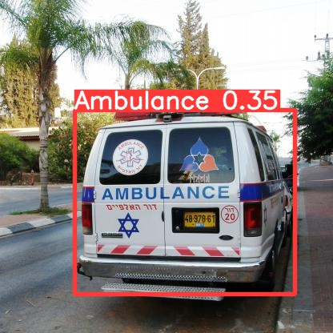
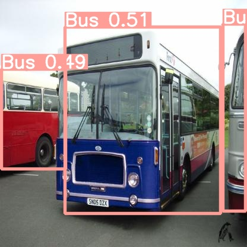
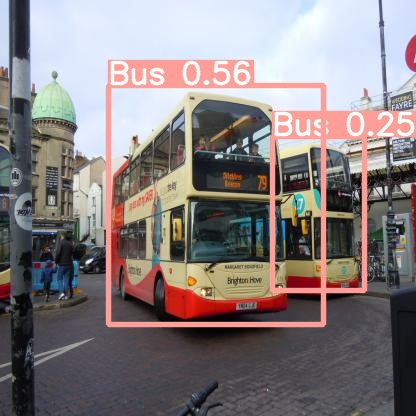
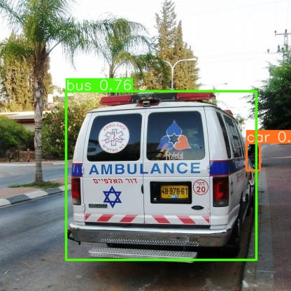
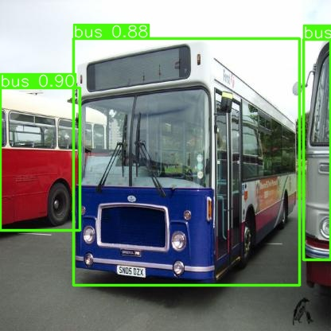
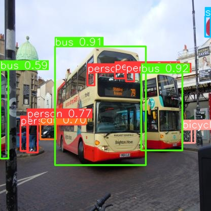

# Object Detection with YOLOv5 and YOLOv8

## Introduction
This project focuses on object detection using YOLOv5 and YOLOv8 models trained on the Vehicle-OpenImages dataset. The dataset contains images of various vehicles in diverse traffic conditions, including cars, buses, motorcycles, trucks, and ambulances.

## Dataset
The Vehicle-OpenImages dataset was obtained from Roboflow, derived from the Open Image dataset. It consists of images representing different traffic scenarios and contains annotations for five classes: Car, Bus, Motorcycle, Truck, and Ambulance.

For each subset of the dataset (train, validation, test), two subfolders were created:

1. **images**: Contains all images corresponding to the specific set.
2. **labels**: Contains one ".txt" file per image, each representing bounding box annotations in YOLO format.

## Model Training and Evaluation
Both YOLOv5 and YOLOv8 models were trained on the dataset, and their performances were compared using mean Average Precision (mAP) values. The evaluation results indicated that YOLOv8 outperformed YOLOv5 in terms of detecting more objects with higher probabilities.

## Detected Images
Below are some example images showcasing the detection results from both YOLOv5 and YOLOv8:

### YOLOv5 Results

### YOLOv8 Results

